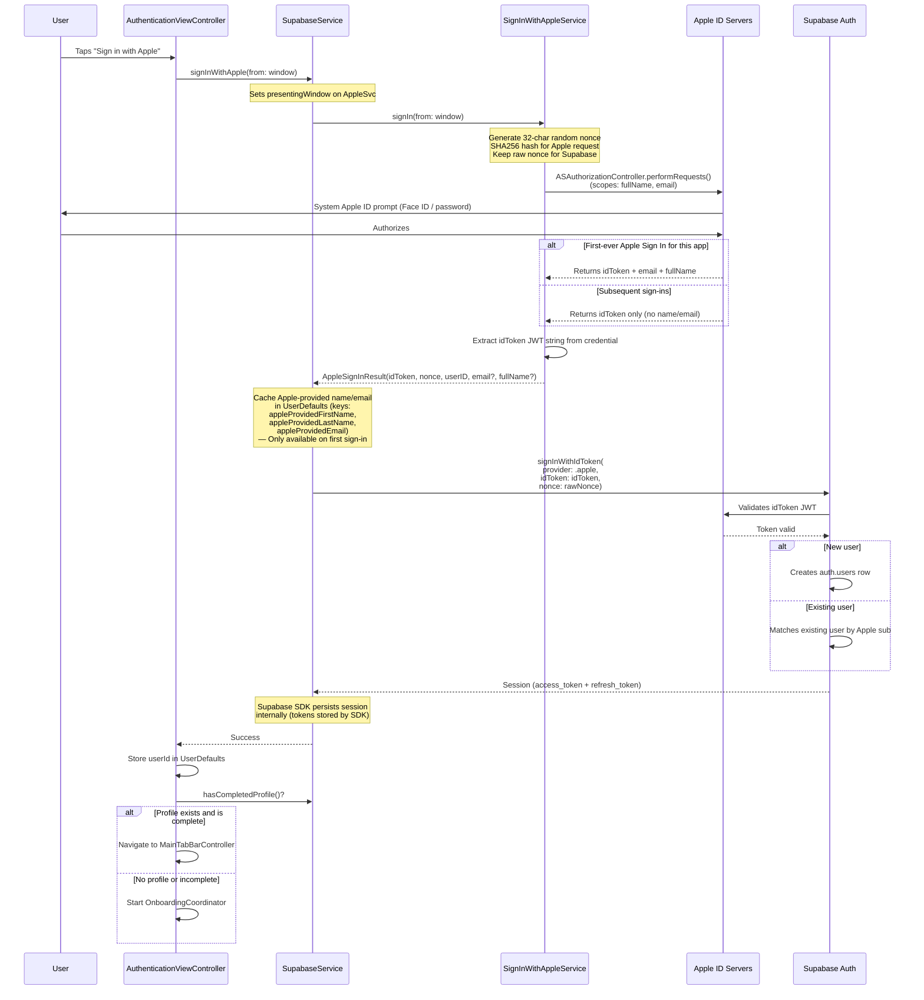
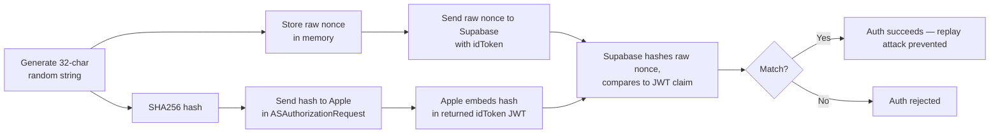
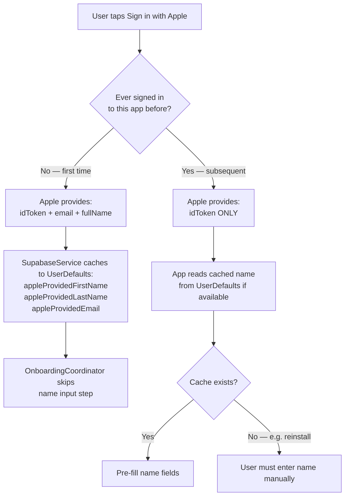
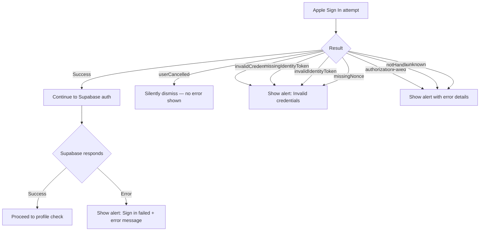

# Apple Sign In Flow

Detailed walkthrough of Sign in with Apple — from button tap to authenticated session.

## End-to-End Flow

## Nonce Security Detail

## Apple's First-Sign-In Data Problem

## Error Handling

## Key Implementation Details

- **Singleton:** `SignInWithAppleService.shared` — reused across AuthenticationVC and LandingVC
- **Async/Await bridge:** Uses `withCheckedThrowingContinuation` to convert delegate callbacks to async
- **Window anchor:** Uses stored `presentingWindow` with fallbacks — critical for iPad multi-window
- **No Keychain usage:** App code does not directly touch Keychain; the Supabase SDK handles token persistence internally
