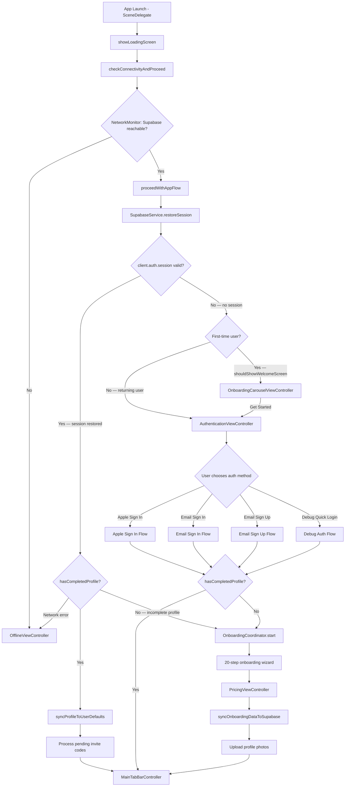

# Authentication Overview

This document provides a high-level map of every authentication scenario in LangChat, how credentials flow, and where state is stored.

## Master Auth Flow — App Launch

## Key Decision Points

| Decision | Where | Logic |
|----------|-------|-------|
| Network available? | `SceneDelegate.checkConnectivityAndProceed` | `NetworkMonitor` pings Supabase URL |
| Session valid? | `SupabaseService.restoreSession` | Supabase SDK loads persisted session, auto-refreshes expired tokens |
| Profile complete? | `SupabaseService.hasCompletedProfile` | Checks `firstName`, `nativeLanguage`, `learningLanguages` exist in Supabase |
| First-time user? | `UserEngagementTracker.shouldShowWelcomeScreen` | Checks UserDefaults flags for prior engagement |

## File Reference

| File | Role |
|------|------|
| `SceneDelegate.swift` | App launch routing, auth state check |
| `Core/Services/SupabaseService.swift` | All Supabase auth methods, session restore, profile sync |
| `Core/Services/SignInWithAppleService.swift` | Native Apple credential acquisition |
| `Core/Config.swift` | Supabase URL & anon key from Info.plist |
| `Features/Authentication/AuthenticationViewController.swift` | Primary auth screen (Apple + Email) |
| `Features/Onboarding/LandingViewController.swift` | Legacy auth screen (same methods) |
| `Features/Onboarding/OnboardingCarouselViewController.swift` | First-time carousel → pushes to auth |
| `Features/Onboarding/WelcomeViewController.swift` | Feature showcase → pushes to auth |
| `Features/Onboarding/OnboardingCoordinator.swift` | Post-auth onboarding wizard |
| `Core/Services/UserEngagementTracker.swift` | Tracks first-time vs returning user |
