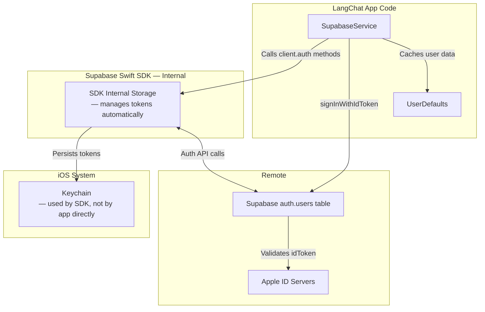
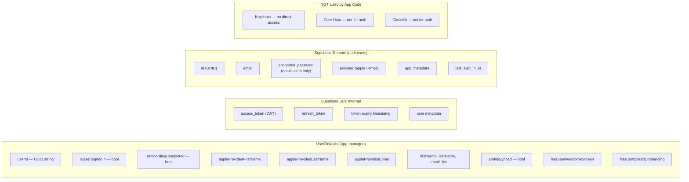
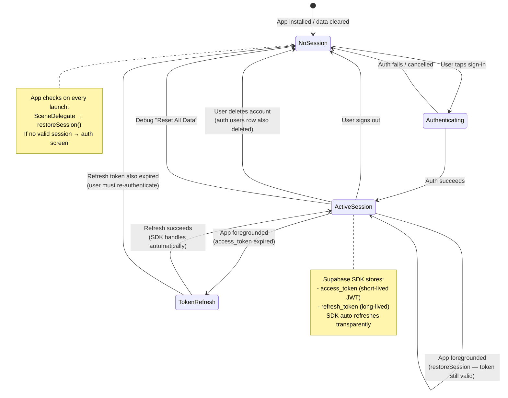
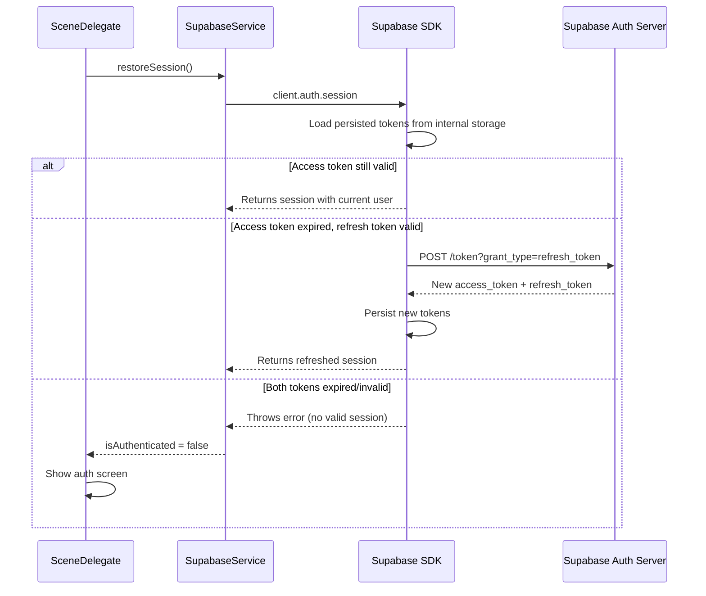

# Credential & Session Storage

Where and how authentication state, tokens, and user data are persisted.

## Storage Architecture

## What Is Stored Where

## Session Lifecycle

## Token Refresh — Handled by SDK

## Sign Out & Account Deletion — Data Cleanup

```mermaid
flowchart TD
    subgraph signout ["Sign Out (SettingsViewController)"]
        SO1[User taps Sign Out] --> SO2[SupabaseService.signOut]
        SO2 --> SO3[client.auth.signOut]
        SO3 --> SO4[SDK clears persisted tokens]
        SO2 --> SO5[Clear UserDefaults keys]
        SO5 --> SO6[Show auth screen]
    end

    subgraph delete ["Delete Account (SettingsViewController)"]
        DA1[User taps Delete Account] --> DA2[Confirmation alert]
        DA2 --> DA3[SupabaseService.deleteAccount]
        DA3 --> DA4[Delete from Supabase tables:<br/>messages, conversations,<br/>reported_users, muse_interactions,<br/>feedback, matches, swipes,<br/>user_languages, user_preferences,<br/>invites, profiles]
        DA4 --> DA5[Delete storage photos]
        DA5 --> DA6[Sign out via client.auth.signOut]
        DA6 --> DA7[Clear all local data]
        DA7 --> DA8[Show auth screen]
    end
```

## Security Observations

| Aspect | Current State | Notes |
|--------|--------------|-------|
| Token storage | Supabase SDK internal (likely Keychain) | App does not directly manage tokens |
| Password storage | Supabase server-side only | Never stored locally |
| Apple idToken | Transient — used once during auth, not persisted | Nonce prevents replay attacks |
| UserDefaults data | Unencrypted | Contains userId, name, email — not secrets, but PII |
| API keys | In Info.plist via Secrets.xcconfig | xcconfig not checked into git |
| Custom Keychain usage | None | App relies entirely on SDK for secure storage |
| Certificate pinning | Not implemented | Noted in CLAUDE.md as desired |
