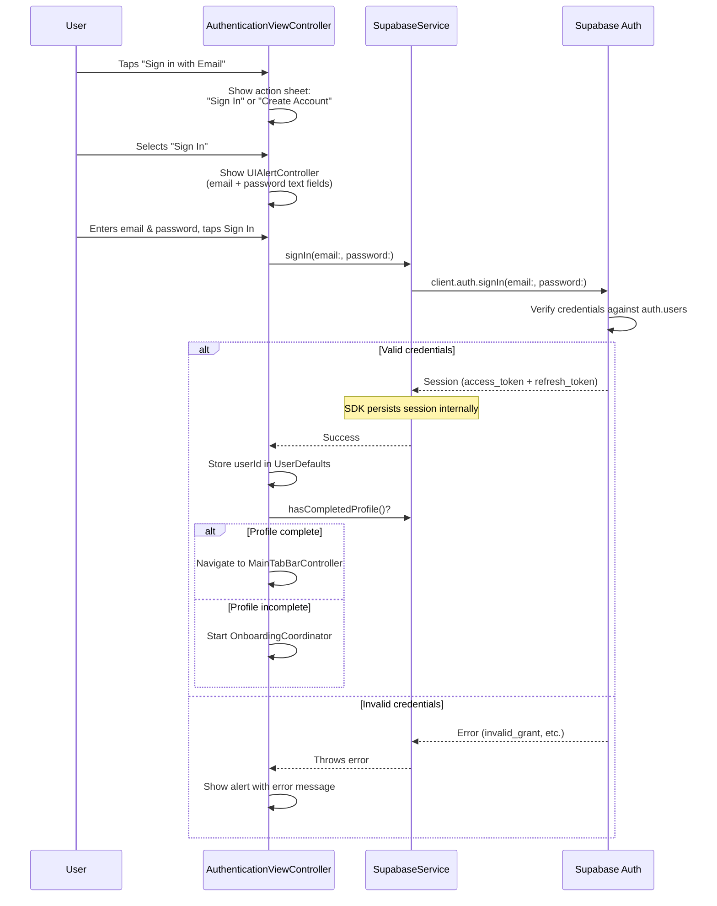
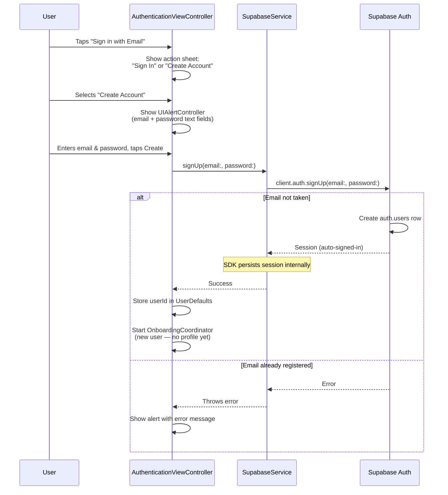
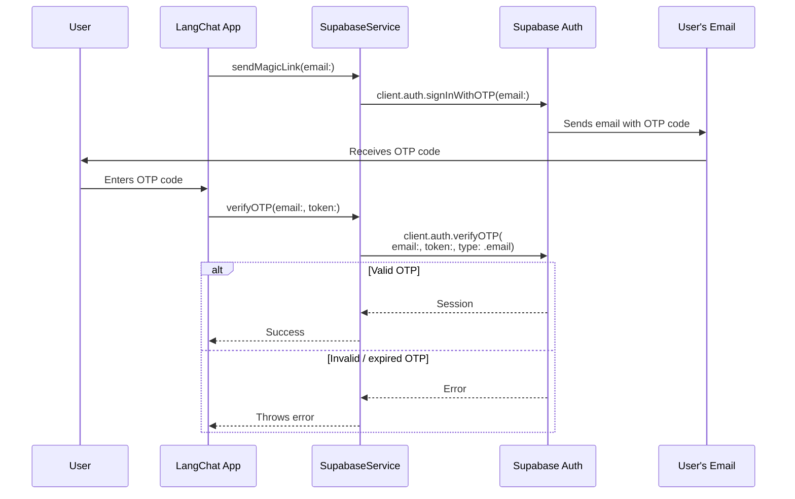
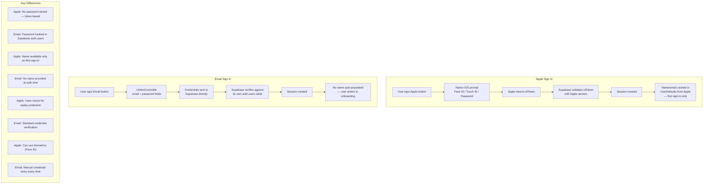
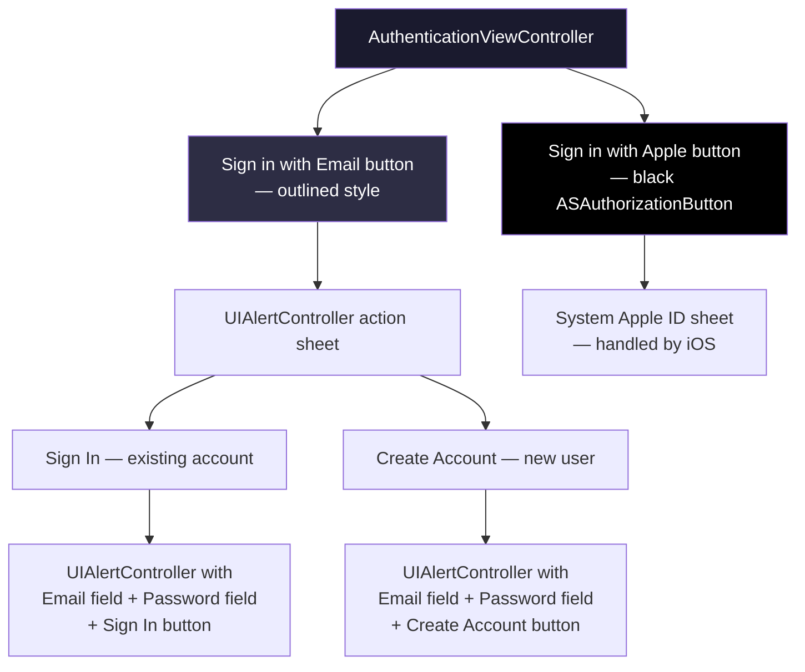
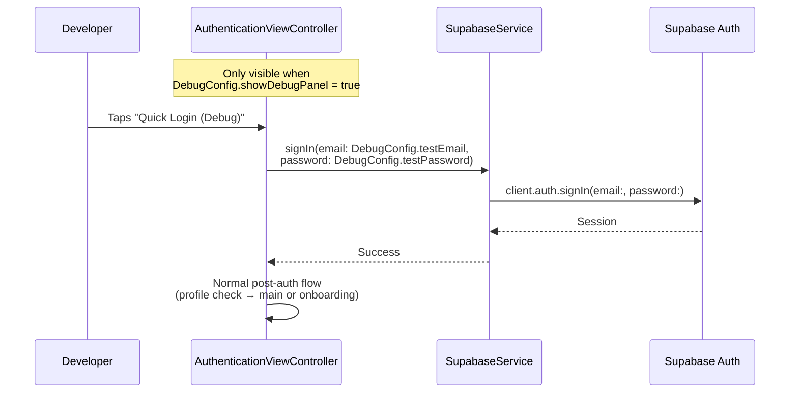

# Email Sign In & Sign Up Flow

Detailed walkthrough of email/password authentication — sign in, sign up, and magic link paths.

## Email Sign In Flow

## Email Sign Up Flow

## Magic Link Flow (Available in SupabaseService, not exposed in current UI)

## Apple Sign In vs Email — Comparison

## What the User Sees (UI Flow)

## Debug Quick Login (DEBUG builds only)

