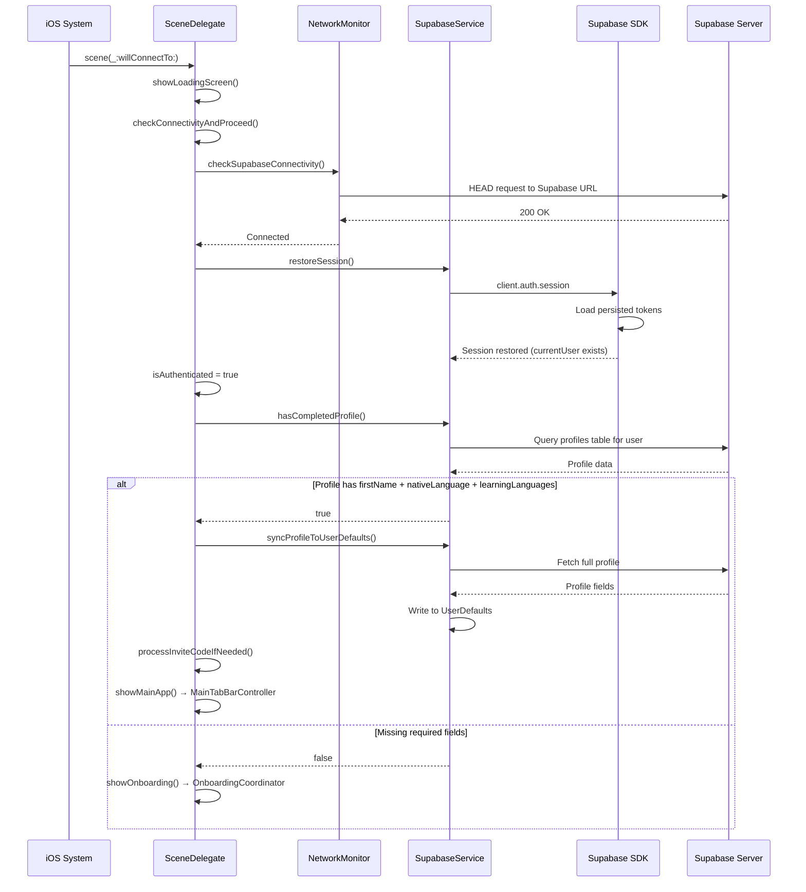
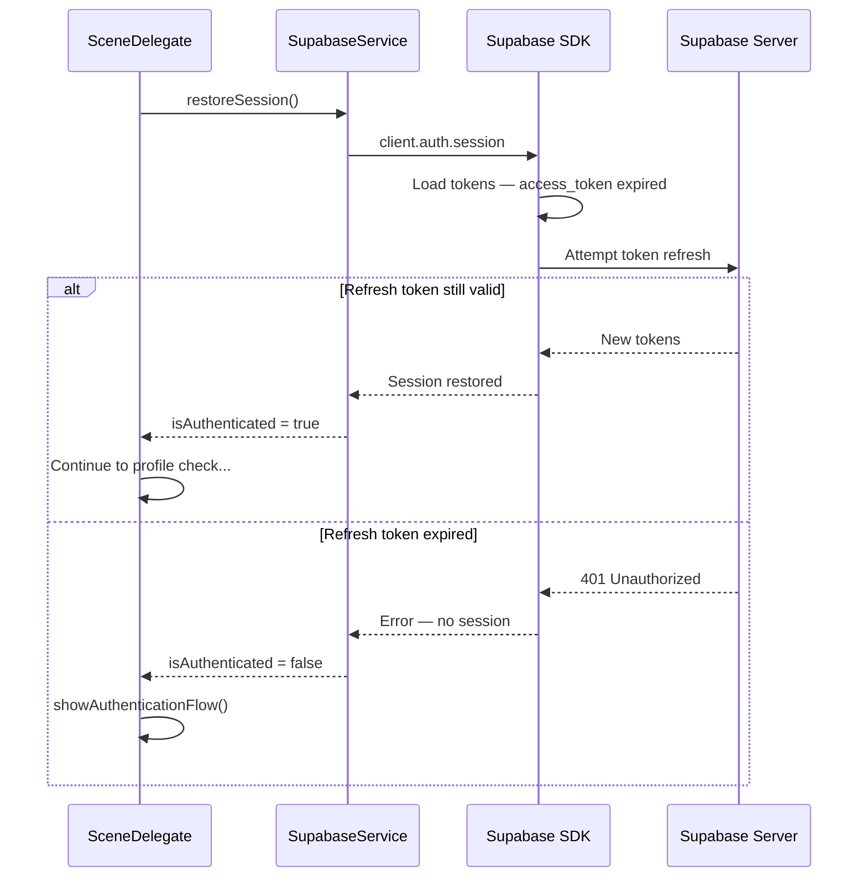
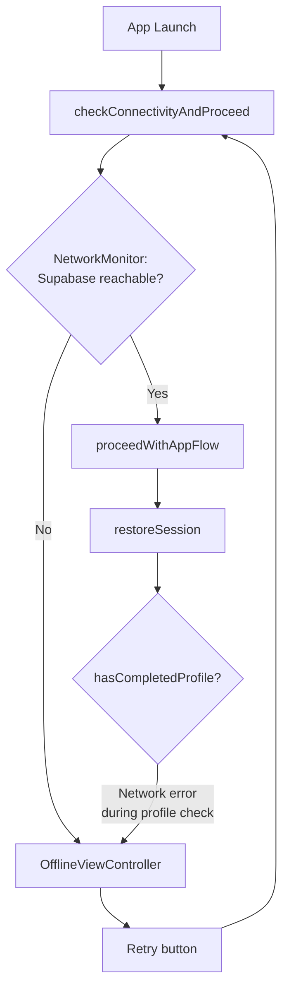
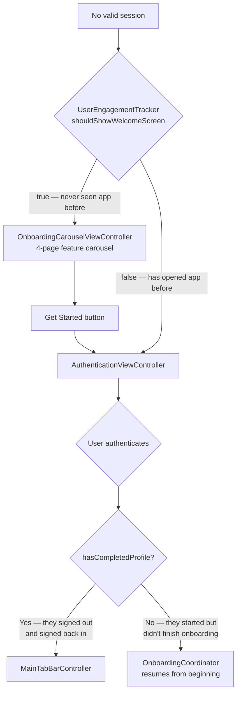
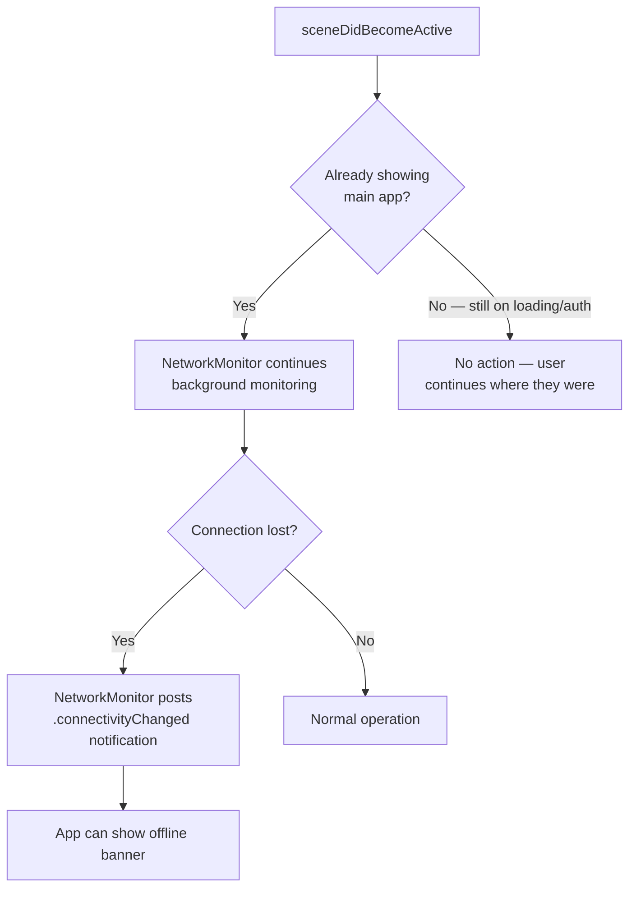
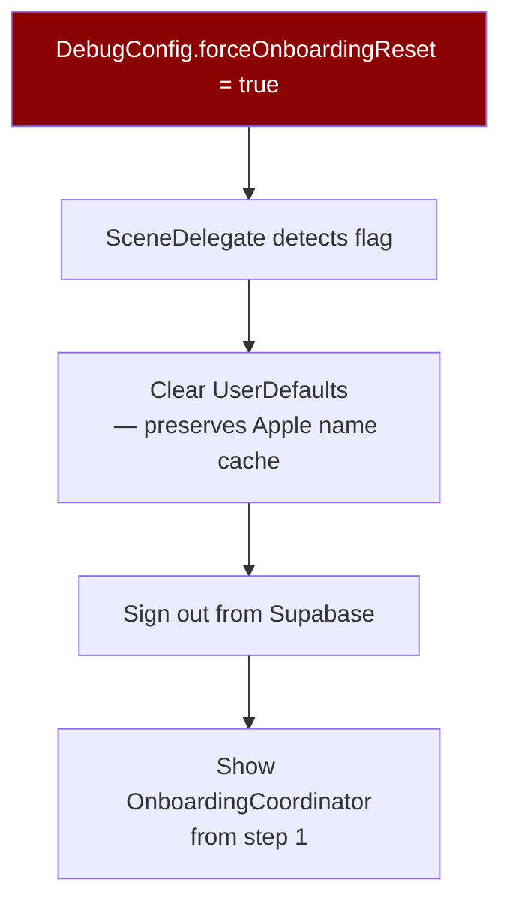

# Session Restore & Returning User Flows

How the app handles users coming back — cold launch, warm launch, and edge cases.

## Cold Launch — Returning Authenticated User

## Cold Launch — Session Expired

## Cold Launch — No Network

## First-Time User vs Returning User

## App Foregrounded (Warm Launch)

## Debug: Force Onboarding Reset

## Edge Cases

| Scenario | Behavior |
|----------|----------|
| User reinstalls app | SDK tokens lost → no session → auth screen. Apple name cache also lost — user must re-enter name in onboarding. |
| User revokes Apple ID access | Next token refresh fails → session invalid → auth screen. User can re-authorize or use email. |
| Supabase down at launch | NetworkMonitor detects failure → OfflineViewController with retry. |
| Profile deleted server-side | `hasCompletedProfile` returns false → sent to onboarding to rebuild profile. |
| User signed up but closed app during onboarding | Session exists but profile incomplete → sent to OnboardingCoordinator on next launch. |
