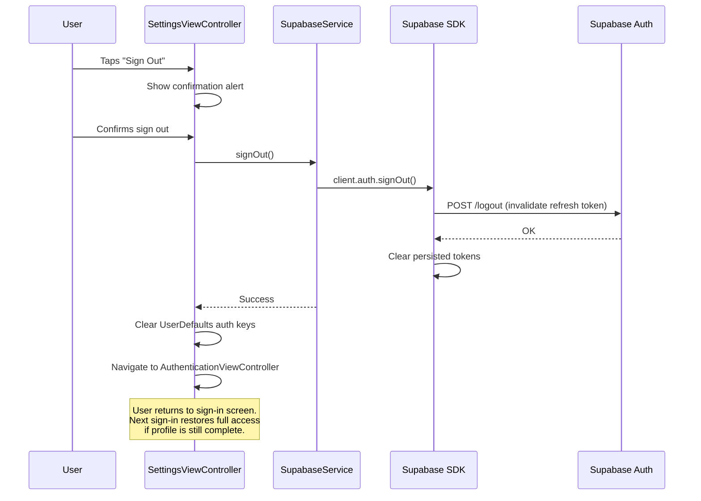
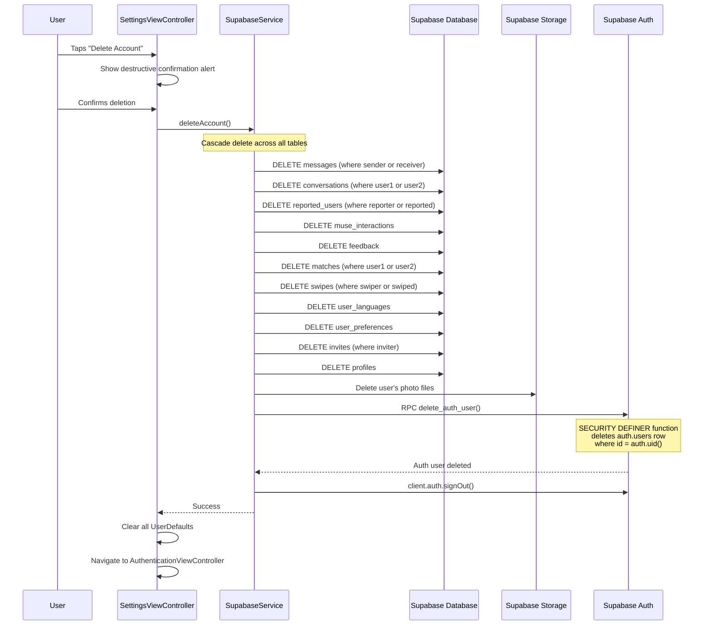
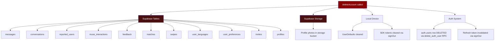
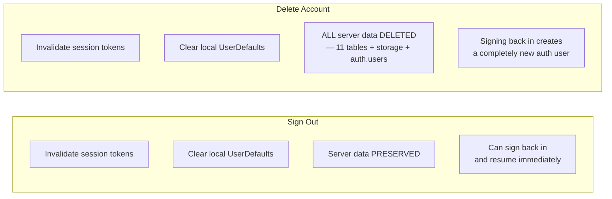

# Sign Out & Account Deletion Flows

How users exit the app and how data is cleaned up.

## Sign Out Flow

## Account Deletion Flow

## Data Deletion Cascade — What Gets Removed

## Sign Out vs Delete — Comparison

## What Survives Sign Out

| Data | After Sign Out | After Delete |
|------|----------------|--------------|
| Supabase auth.users row | Kept | **Deleted** via `delete_auth_user()` RPC |
| Profile in profiles table | Kept | Deleted |
| Matches & swipes | Kept | Deleted |
| Messages & conversations | Kept | Deleted |
| Photos in storage | Kept | Deleted |
| UserDefaults (local) | Cleared | Cleared |
| SDK tokens (local) | Cleared | Cleared |
| Apple ID association | Kept | Kept (Apple-side, not app-controlled) |

> **Note:** The `auth.users` row is now deleted via the `delete_auth_user()` Postgres function (SECURITY DEFINER). This function verifies `auth.uid()` matches the caller, then deletes the row from `auth.users`. It is called while the user is still authenticated, just before the final `signOut()`. If a user signs up again with the same Apple ID or email, Supabase will create a completely new auth user with a new UUID.
